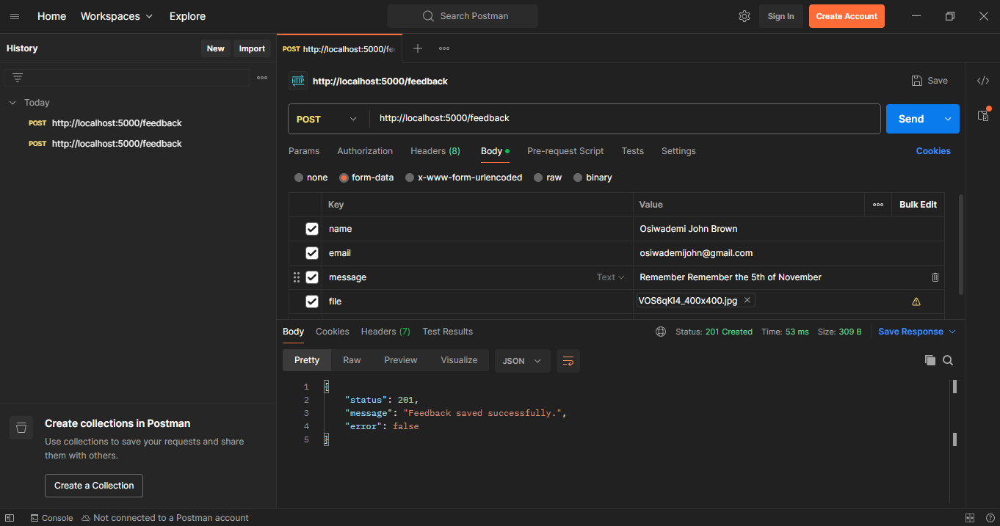

# Building a User Feedback Collector with Node.js and Express.js

## Introduction
This project collects user feedback via a form and save it in a local file. A user feedback collector is a fundamental feature in many applications, it is a tool or system, used to gather feedback from users about their experience with a product or service. It helps project teams understand what users think, feel, or need, and is essential for making informed improvements.

## Prerequisites
- Basic knowledge of JavaScript, Node.js and Express.
- Node.js, git and npm installed on your computer.


## Features
- Accepts feedback with **name**, **email**, **message**, and an **image**.
- Validates all input fields, including email format and message length.
- Accepts only **.jpeg, .jpg, .png** images up to **10MB**.
- Saves uploaded files to the `/uploads` folder.
- Persists feedback in a local `feedbacks.json` file.

## Project Structure

```
TC-Feedback-Collector/
├──controllers/		// Handles request logic
├──middleware/		// Custom middleware functions
├──model/
├──routes/			// API route definition
├──service/
├──utility/
├──app.js			    // main application file
├──.gitignore			// gitignore file
├──package.json		// Project dependencies
└──README.md		   //documentation file
```

## Project setup
- Clone the repository and navigate to the project directory

```
git clone https://github.com/Jerryemmanuel01/TC-Feedback-Collector.git
cd TC-Feedback-Collector
```
- Initialize the project as a node.js project.
```
npm init -y
```
This will create a `package.json` file

- Install dependencies

```
npm install express multer nodemon path
```
**express**: Simplifies the process of building web servers and APIs.
**multer**: Allows users to upload files via forms (e.g., images, documents).
**nodemon**: Automatically restarts the Node.js application when file changes are detected.
**path**: Provides utilities for working with file and directory paths in a way that is platform-independent.

### 1. Setting up the Server
This is the main server file `app.js`. It sets up an Express.js server, serves static files (uploaded images), routes feedback submissions to `/feedback` and also parses incoming JSON and URL-encoded form data.

### 2. Setting up `saveFeedback` file
The code defines a function that handles saving user feedback to a local JSON file (feedbacks.json) on the server.

### 3. Setting up the middleware
The middleware folder contains two files; `fileUpload` and `validateFeedback` files.
- **fileupload.js**: This code sets up file upload handling in a Node.js application using the Multer middleware. It securely handles file uploads by saving them in a dedicated folder, naming them uniquely and enforcing file type and size restrictions.
- **validateFeedback.js**:  This code performs server-side validation on the feedback submission request before it's processed further. It ensures the submitted data is well-formed and meets specific rules

### 4. Creating the routes
This code sets up an Express.js route for handling user feedback submissions. The POST endpoint (/) validates incoming feedback data and saves the feedback to storage (JSON file)

### 5. Run the Application

```
npm run start
```
 

### 6. Testing the Application using Postman
`/feedback` is the main endpoint that accepts a feedback submission.
- Enter the url

```
http://localhost:5000/feedback
```

- Set the body type to `form-data
`
- Add the necessary key-value pairs

| Key     | Type | Value                     |
| ------- | ---- | --------------------------|
| name    | Text | Samson                    |
| email   | Text | testing@gmail.com         |
| message | Text | Just testing this route   |
| file    | File | Image.jpg                 |


- Send the request. If all validations pass, you’ll get a success response like:

```
{
  "status": 201,
  "message": "Feedback saved successfully.",
  "error": false
}
```

## Conclusion
This project is a simple yet effective solution for gathering structured user feedback along with image uploads. It demonstrates key backend development practices, including form validation, file handling with Multer, and structured routing in Express.js. 

## Contributors
[Abdulmalik Hussein](husseinabdulmalik0@gmail.com)
[Bright Bediako](bright.bediako.dev@gmail.com)
[Adeniyi Adebimpe](adeniyiadebimpe04@gmail.com) 
[Adejumo David ](davidadejumo10@gmail.com) 
[Dominic Jerryemmanuel](jerryemmanuelolisa@gmail.com)
[Adekoya Adegbenga](adegbengaoluwatosin61@gmail.com ) 
[Ameh Mathias Ejeh](amehmathiasejeh40@gmail.com)
[Basit Adebayo](bahseet2022@gmail.com)
[Daniel Kasambala](danielkasambala51@gmail.com)

## Tested By Daniel Kasambala 

## Tested By Abdulmalik Hussein

